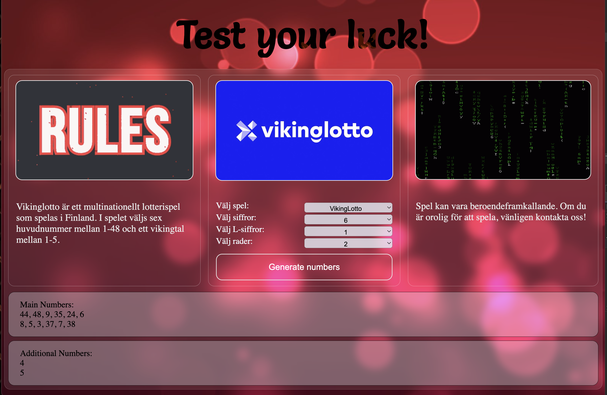

# Lotto

  
---
## Description

When you launch the game, you must select the game from the drop-down menu.
Below are the criteria for various games.

* Lotto: from 1 to 7 numbers from 1-40; 1 additional number from 1-40
* EuroJackpot: from 1 to 5 numbers from 1-50; 2 additional numbers from 1-12
* ViktingLotto: from 1 to 6 numbers from 1-48; 1 additional number from 1-5
* Keno: from 1 to 10 numbers from 1-70

P.S.The text in the game is in Swedish

***

  

[Up](#anchor)
